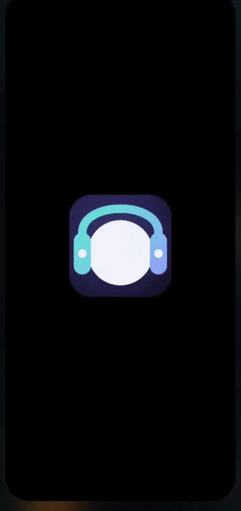
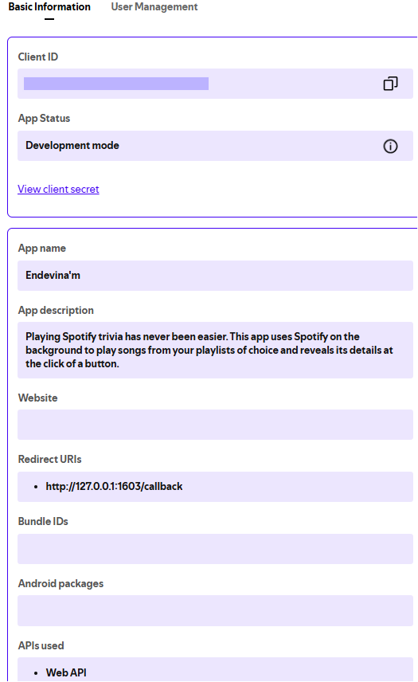
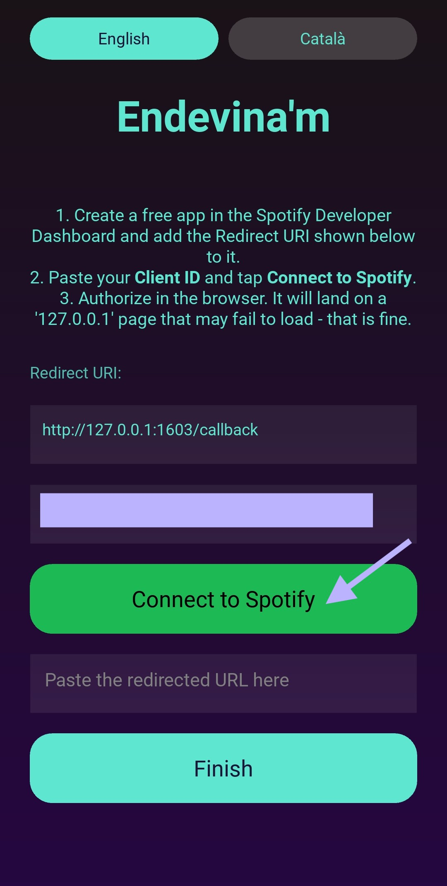
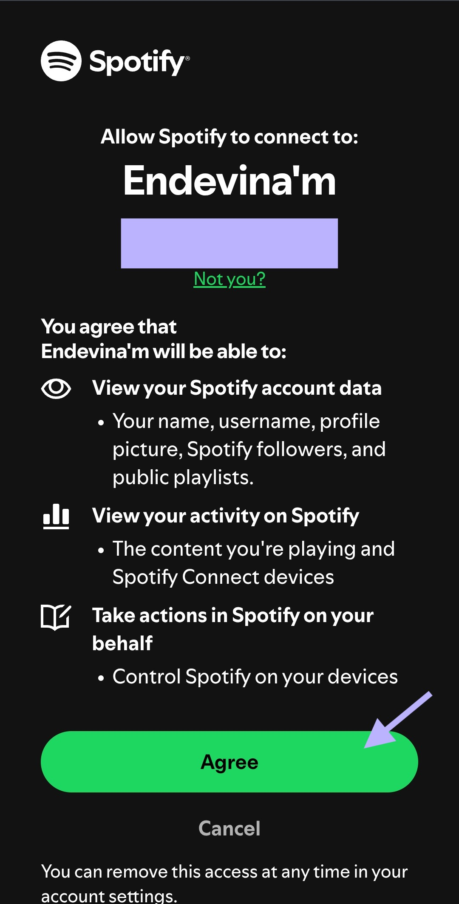

# Endevina'm

A free, open-source, Hitster-style music guessing game built around your own Spotify
playlists. Pool tracks from public playlists, play a random song on your active Spotify
device, and guess the artist and year before the reveal.

> **What's in the name?** *Endevina'm* means **"guess me"** in Catalan — a nod to the
> game itself: a song plays and you have to guess it.

**This is a personal-use hobby app. It is not affiliated with, endorsed by, or sponsored
by Spotify or by Jumbo / Hitster.** See [docs/DISCLAIMER.md](docs/DISCLAIMER.md).

<!-- TODO before launch: record a 10-15s demo and save it as media/demo.gif.
Suggested clip: add playlist -> Start game -> dancing figure -> Reveal with the
album-art recolour. This is the single most important asset for adoption. -->


For a Spotify playlist with a balanced distribution of dates across decades, try [E'm EN](https://open.spotify.com/playlist/2PZANz2xnE8LdekKA3sE9J?si=8696ecb117534202) as used in the demo.

---

## ⭐ Support this project

Endevina'm is free and will stay free. If you enjoy it, a small tip keeps it maintained:

- ❤️ [GitHub Sponsors](https://github.com/sponsors/Ilumirnau) — recurring or one-time
- ☕ [Ko-fi](https://ko-fi.com/ilumirnau) — one-tap tip, no account needed

---

## What you need

- **Spotify Premium** (the Web API can only control playback on Premium accounts).
- An **open Spotify session** on a device you want to play through (phone, desktop, speaker).
- A **free Spotify developer app** — you create this yourself in two minutes (see Setup below).
  Endevina'm never ships with bundled credentials; you bring your own.

## Why you set up your own Spotify credentials

Spotify's Developer Terms allow apps like this one to run for **private personal use**, as
long as each person uses their own developer credentials. Creating your own free Spotify app
means every install runs under your own account — fully within Spotify's rules — and it keeps
Endevina'm free, with no shared quota and nothing for me to host. It takes about two minutes,
and you only do it once.

## Setup (one time, ~2 minutes)

1. Go to the [Spotify Developer Dashboard](https://developer.spotify.com/dashboard) and log in.
2. Click **Create app**. Name it anything (e.g. "My Endevina'm"). When it asks
   which APIs you plan to use, tick **Web API** only — that's all the game needs,
   and it's what reveals the Redirect URI field below. You do **not** need the
   Web Playback SDK, Android, iOS, or Ads API (the game controls an existing
   Spotify device over the Web API, even on phones).
3. Set the **Redirect URI** to exactly:
   ```
   http://127.0.0.1:1603/callback
   ```
   (Endevina'm shows you this exact value on the connect screen — copy it verbatim.)
4. Save, then open the app's **Basic Information** and copy the **Client ID** (32-digit code). See the following example:



5. Launch Endevina'm, paste the Client ID when prompted. You will be redirected to your browser, authorise your freshly created app (e.g. "My Endevina'm").

 
 

6. You will be redirected to another URL. Copy it.
7. Go back to Endevina'm, paste the URL, and press "Finish".
8. Enjoy the game.

Your Client ID and login token are stored **only on your own device**. See
[docs/PRIVACY.md](docs/PRIVACY.md).

## How to play

1. Paste one or more **public** Spotify playlist links and tap **Add** to pool their tracks.
   (Tap **See Details** for a per-decade breakdown of the pool.)
2. Tap **Start game**. A random track plays on your active device. The setup UI hides and a
   colour-themed dancing stick figure appears — its dance style is chosen from the artist's
   genre tags.
3. Players guess the **artist** and **year**.
4. Tap **Reveal Song**. Playback pauses; artist, year, title, and album art appear, and the whole
   UI is recoloured from the album's dominant palette.
5. Tap **Next**. That track is dropped from the pool and another random track plays.

Pick your playback device once (the **Set device** row) before starting; it's reused for the
whole session.

## Download & run

Prebuilt binaries are attached to each [Release](https://github.com/Ilumirnau/endevinam/releases),
built automatically on GitHub's runners (see [`.github/workflows/release.yml`](.github/workflows/release.yml)):

- **Windows / macOS / Linux** — download the bundle for your OS and run it. The binaries are
  unsigned, so the OS shows a one-time warning the first time: on Windows, SmartScreen →
  *More info* → *Run anyway*; on macOS, right-click → *Open* (the macOS build is Apple Silicon).
- **Android** — download the `.apk` and install (you may need to allow installs from
  unknown sources). Not currently on the Play Store; F-Droid availability is tracked in the
  issues.
- **iPhone (iOS)** — no download available. An installable build needs Apple code signing, which
  CI can't do without a paid Apple Developer account; build it from source instead (below).

## Build from source

Endevina'm is a single Kivy application (`endevinam.py`).

```bash
# Desktop
pip install -r requirements.txt
python endevinam.py

# Package a desktop binary (Windows / macOS / Linux)
pip install pyinstaller
pyinstaller endevinam.spec          # output: dist/Endevinam[.exe]

# Package an Android APK (run on Linux / WSL / macOS only)
pip install buildozer cython
buildozer -v android debug          # output: bin/endevinam-1.0-debug.apk
```

### iPhone (iOS) build

The Windows, macOS, Linux and Android bundles are built for you by CI and attached to each
Release. iOS is the one platform that can't be: an installable `.ipa` has to be code-signed,
and that needs a paid Apple Developer account, so there's nothing to download. You can still
run it on your own iPhone by building from source and signing with your own (free) Apple ID.

Kivy builds for iOS with [kivy-ios](https://github.com/kivy/kivy-ios), not buildozer. You need
macOS with Xcode and its command-line tools. From this folder:

```bash
pip install kivy-ios

# Build the Python runtime and the native dependencies (one-time, slow).
toolchain build python3 kivy pillow

# Add the pure-Python dependencies into the build.
toolchain pip install spotipy requests certifi urllib3 charset-normalizer idna

# Generate an Xcode project for the app (entry point is main.py).
toolchain create Endevinam .
```

Then open `endevinam-ios/endevinam.xcodeproj` in Xcode, set your Bundle Identifier and signing
team (a free Apple ID works — the app stays valid on your device for 7 days, after which you
re-sign), and build to a connected iPhone. The Spotify login uses the same `127.0.0.1`
copy-paste flow as Android, so no custom URL scheme or extra Xcode setup is needed.

If you have a paid Apple Developer account and produce a signed build others can install via
TestFlight or ad-hoc distribution, open an issue or PR — I'm happy to link it from the Releases
page with credit. Please build only from a clean checkout so it matches the public source.

## Contributing

Issues and pull requests are welcome. By contributing you agree your contributions are
licensed under GPLv3 (see below). Please keep changes within Spotify's Developer Terms —
in particular, do **not** add bundled credentials, ad/tracking SDKs, content scraping, or
anything that stores Spotify data beyond what's needed to run a session.

## Licence

GPLv3. See [LICENSE](LICENSE). A short overview of how it was applied is in
[docs/LICENSE-instructions.md](docs/LICENSE-instructions.md).
